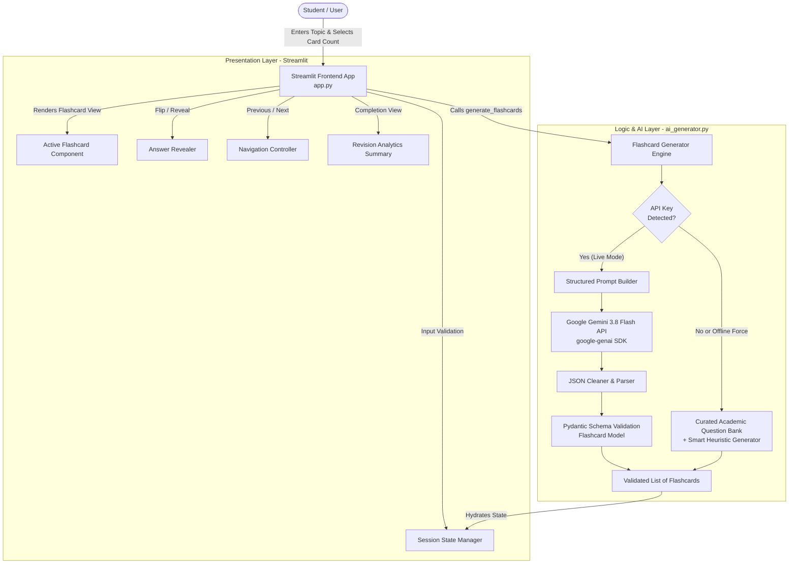

# System Architecture & Technical Flow

## Overview
**Smart Flashcards** is an AI-powered study and revision assistant designed for engineering and college students. It integrates a modern Python Streamlit interface with Google's Gemini Generative AI model (`gemini-3.8-flash`) through structured JSON schemas.

---

## 1. System Architecture Diagram

---

## 2. Component Breakdown

| Component | File | Responsibilities |
|---|---|---|
| **Presentation Layer** | `app.py` | UI rendering, user interaction, state management, custom CSS styling, progress calculation, and completion summary. |
| **Generative AI Engine** | `ai_generator.py` | Prompt construction, Google GenAI SDK client orchestration, JSON parsing, structured Pydantic schema validation. |
| **Demo / Simulation Fallback** | `ai_generator.py` | Standalone mock engine with curated college curriculum question banks (ML, Python, DBMS, OS) and smart heuristics for offline evaluation. |
| **Environment Configuration** | `.env` / `.env.example` | Securely stores `GEMINI_API_KEY` without hardcoding credentials into source code. |

---

## 3. Data Flow & Lifecyle

1. **Input Phase:**
   - The student inputs a topic (e.g., *"Machine Learning"*) and selects card count (*5, 10, or 15*).
   - Empty input validation ensures the user cannot submit blank queries.
2. **AI Generation Phase:**
   - The app verifies whether `GEMINI_API_KEY` is present.
   - **If Live:** The app sends an academic instruction prompt to Gemini 3.8 Flash enforcing a strict JSON schema: `[{"question": "...", "answer": "..."}]`.
   - **If Demo:** Curated questions are loaded instantly with clear visual labeling (`🧪 Demo Mode`).
   - Responses are validated via Pydantic (`Flashcard` model) to guarantee data integrity before display.
3. **Interactive Study Phase:**
   - Cards are displayed one at a time.
   - The user reads the question and tests their recall.
   - Clicking **"Show Answer"** flips/reveals the concise answer.
   - **"Next"** and **"Previous"** buttons allow smooth traversal with dynamic progress tracking (`Card X of Y`).
4. **Summary & Mastery Phase:**
   - Upon completing the final card, balloons celebrate completion.
   - The student views metrics: Total Cards, Cards Reviewed, Completion %.
   - Options to **"Review Again"** (re-shuffles/restarts) or **"Generate New Cards"** for another topic.
